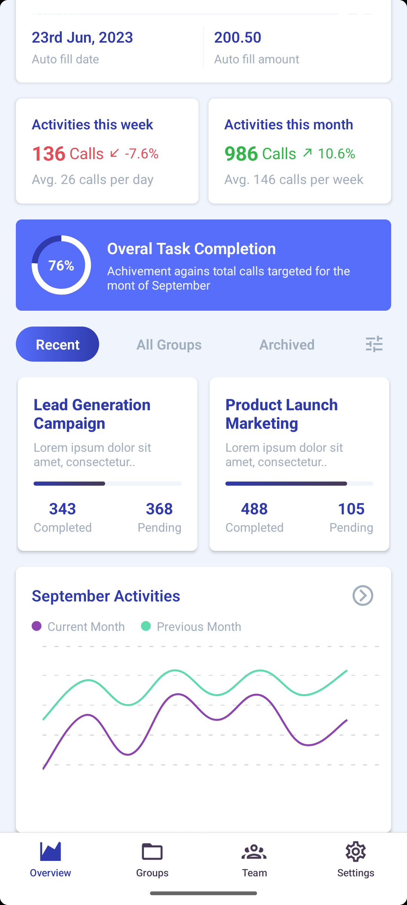

# BalanceBoard – React Native Dashboard UI

**BalanceBoard** is a mobile dashboard UI built using **React Native** and **TypeScript**, featuring animated charts, responsive layouts, and clean visual styling.

## Features

- **Interactive Charts**
  - Line chart with `react-native-gifted-charts`
  - Circular progress with `react-native-circular-progress`
- **API Integration** using Axios for real-time balance data
- **State Management** with Redux Toolkit
- **Custom Styling** using StyleSheet (no external design libraries)

## Tech Stack

- **React Native + TypeScript**
- **Redux Toolkit**
- **Axios**
- **Chart Libraries**:
  - `react-native-gifted-charts`
  - `react-native-circular-progress`

## Screenshots

 <p align="center">
  
  &nbsp;&nbsp;
  
  &nbsp;&nbsp;
  
</p>

## Getting Started

Follow these steps to set up and run the project:

1. **Clone the repository:**

   ```bash
   git clone https://github.com/anushree-more123/BalanceBoard.git
   cd BalanceBoard

   ```

2. Install the required dependencies:

   ```bash
   npm install

   ```

3. Start the development server (Metro Bundler):

   ```bash
    npx react-native start
   ```

4. Run the app on Android:

   ```bash
    npx react-native run-android
   ```

5. Run the app on iOS (macOS only):
   ```bash
    npx react-native run-ios
   ```
